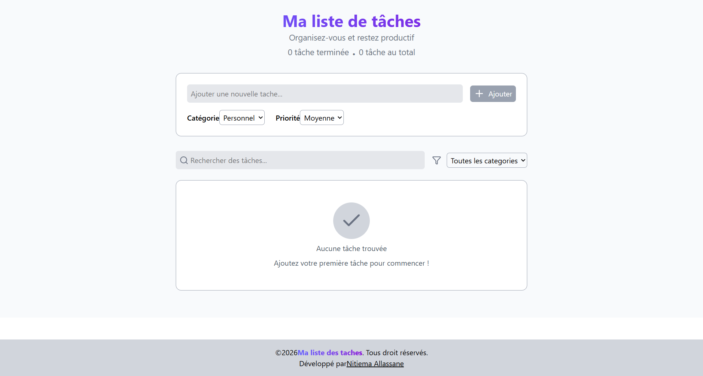
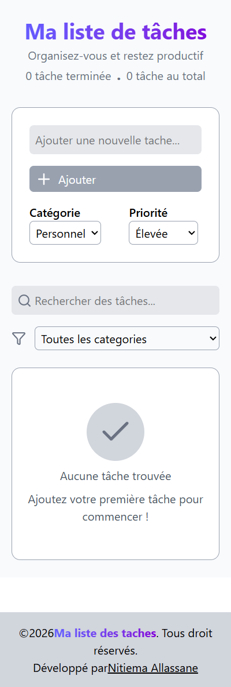
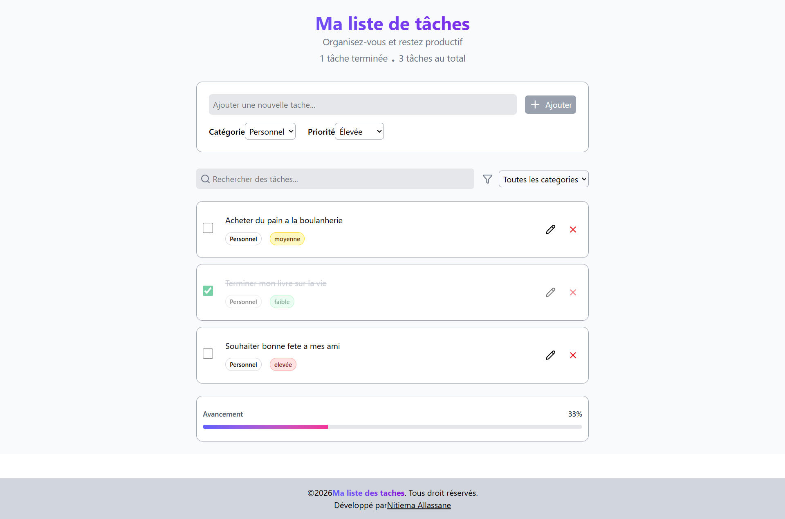
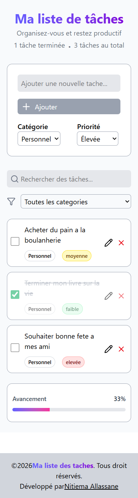

# Todo App – React + TypeScript

Une application moderne de gestion de tâches développée avec **React**, **TypeScript** et **Tailwind CSS**.
Elle permet d’ajouter, modifier, supprimer et filtrer des tâches avec une interface simple et efficace.

---

## Demo en ligne

[Decouvrez l'application en ligne](https://todo-nit.vercel.app/)

## Fonctionnalités

* Ajouter une tâche
*  Modifier une tâche
* Supprimer une tâche
*  Marquer une tâche comme terminée
*  Rechercher des tâches
*  Filtrer par catégorie
*  Barre de progression dynamique
*  Gestion des états vides (Empty State)

---

## 🛠️ Technologies utilisées

* React
*  TypeScript
*  Tailwind CSS
*  Lucide Icons
*  clsx (gestion des classes conditionnelles)

---

## Structure du projet
Vous pouvez refactoriser le projet pour faire ressembler le projet a ceci:

```
src/
│── components/
│   ├── Header.tsx
│   ├── AddForm.tsx
│   ├── SearchForm.tsx
│   ├── Task.tsx
│   ├── ProgressBar.tsx
│   └── EmptyState.tsx
│
│── App.tsx
│── main.tsx
│── index.css
```

---

## Installation

1. Cloner le projet :

```bash
git clone https://github.com/NitiemaAllassane/todoWebApp
```

2. Installer les dépendances :

```bash
pnpm install
```

3. Lancer le projet :

```bash
pnpm run dev
```

---

##  Logique clé

* Utilisation de `useState` pour gérer les tâches
* Manipulation des tableaux avec :

  * `map` → modification
  * `filter` → suppression / recherche
* Filtres combinés (recherche + catégorie)
* UI conditionnelle (Empty state vs liste)

---

## Objectif du projet

Ce projet a été réalisé dans le but de :

* pratiquer React et TypeScript
* comprendre la gestion d’état
* manipuler des données dynamiques
* construire une UI propre et maintenable

---

## Améliorations possibles

* Sauvegarde avec `localStorage`
*  Mode sombre
*  Ajout de date de création
*  Drag & drop des tâches
*  Notifications / rappels
*  Effets sonore quand on termine une tache

---

## Aperçu






---

## Auteur

Développé par [Nitiema Allassane](https://nitiema-allassane.vercel.app/about)

---

## 📄 Licence

Ce projet est open-source et libre d’utilisation.
